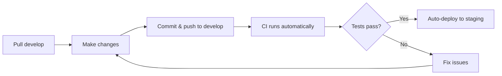

# Branch Consolidation Migration Guide
## From 10+ Branches to 2-Branch Strategy

**Migration Date:** Week of October 14, 2025  
**Team Impact:** All developers  
**Estimated Time:** 1 week  
**Downtime Required:** None

---

## 🎯 Objectives

Consolidate from the current multi-branch setup to a streamlined 2-branch strategy:

**Before:** 10+ active branches  
**After:** 2 protected branches (`main`, `develop`)

### Benefits:
- ✅ Simpler workflow
- ✅ Faster onboarding
- ✅ Reduced CI/CD complexity
- ✅ Fewer merge conflicts
- ✅ Clear deployment path

---

## 📊 Current Branch Analysis

### Identified Branches (Assumed):

```
main                    ← Production
develop                 ← Integration
feature/frontend-ui     ← Active
feature/security        ← Active
feature/mlops           ← Active
feature/async-proc      ← Active
hotfix/auth-bug         ← Merged, needs deletion
release/v1.0            ← Stale
experimental/ai-v2      ← Inactive
dev/john-testing        ← Personal branch
dev/sarah-wip           ← Personal branch
```

### Branch Status Audit:

| Branch | Status | Last Commit | Action |
|--------|--------|-------------|--------|
| `main` | Active | 2 days ago | **Keep** |
| `develop` | Active | 1 day ago | **Keep** |
| `feature/frontend-ui` | Active | 4 hours ago | **Merge to develop** |
| `feature/security` | Active | 1 day ago | **Merge to develop** |
| `feature/mlops` | Active | 3 days ago | **Merge to develop** |
| `feature/async-proc` | Active | 2 days ago | **Merge to develop** |
| `hotfix/auth-bug` | Merged | 7 days ago | **Delete** |
| `release/v1.0` | Stale | 30 days ago | **Delete** |
| `experimental/ai-v2` | Inactive | 60 days ago | **Archive & Delete** |
| `dev/john-testing` | Personal | 5 days ago | **Delete (local only)** |
| `dev/sarah-wip` | Personal | 10 days ago | **Delete (local only)** |

---

## 🚀 Migration Plan

### Phase 1: Preparation (Day 1)

#### Step 1.1: Backup Everything

```bash
# 1. Create backup branch for each active branch
git checkout feature/frontend-ui
git branch backup/frontend-ui-20251014
git push origin backup/frontend-ui-20251014

git checkout feature/security
git branch backup/security-20251014
git push origin backup/security-20251014

# Repeat for all active branches
```

#### Step 1.2: Document All Active Work

Create a tracking document:

```markdown
# Active Work Inventory - October 14, 2025

## feature/frontend-ui
- Owner: Sarah
- Status: 85% complete
- Changes: 47 files
- Next steps: Merge to develop after testing
- Blockers: None

## feature/security
- Owner: John
- Status: 95% complete
- Changes: 23 files
- Next steps: Ready to merge
- Blockers: Waiting for security review

## feature/mlops
- Owner: Mike
- Status: 60% complete
- Changes: 31 files
- Next steps: Needs 1 more week
- Blockers: MLflow deployment pending

## feature/async-proc
- Owner: Lisa
- Status: 100% complete
- Changes: 18 files
- Next steps: Ready to merge immediately
- Blockers: None
```

#### Step 1.3: Team Communication

Send announcement:

```
Subject: Branch Strategy Simplification - Action Required

Team,

On October 18, we're simplifying our Git workflow from 10+ branches to 2 branches:
- main (production)
- develop (integration)

ACTIONS REQUIRED by October 17:
1. Merge or rebase your feature branches to develop
2. Delete personal/test branches
3. Review the migration guide: [link]

Questions? Join the sync on October 15 at 2 PM.

Thanks!
```

---

### Phase 2: Branch Protection Setup (Day 2)

#### Step 2.1: Configure Branch Protection for `main`

**GitHub Settings → Branches → Branch protection rules**

```yaml
Branch name pattern: main

Rules:
✅ Require a pull request before merging
  ✅ Require approvals: 2
  ✅ Dismiss stale pull request approvals when new commits are pushed
  ✅ Require review from Code Owners

✅ Require status checks to pass before merging
  ✅ Require branches to be up to date before merging
  Required checks:
    - ci / code-quality
    - ci / backend-tests
    - ci / frontend-tests
    - ci / security-scan
    - ci / migration-tests

✅ Require conversation resolution before merging

✅ Require signed commits

✅ Require linear history

✅ Include administrators

✅ Restrict who can push to matching branches
  People/teams:
    - @tech-leads
    - @senior-developers

✅ Allow force pushes: ❌ (Never)

✅ Allow deletions: ❌ (Never)
```

#### Step 2.2: Configure Branch Protection for `develop`

```yaml
Branch name pattern: develop

Rules:
✅ Require a pull request before merging
  ✅ Require approvals: 1
  ✅ Dismiss stale pull request approvals when new commits are pushed

✅ Require status checks to pass before merging
  ✅ Require branches to be up to date before merging
  Required checks:
    - ci / code-quality
    - ci / backend-tests
    - ci / frontend-tests

✅ Require conversation resolution before merging

✅ Include administrators

✅ Allow force pushes: ❌ (Never)

✅ Allow deletions: ❌ (Never)
```

---

### Phase 3: Merge Active Branches (Days 3-4)

#### Priority 1: Merge Completed Work

**Feature: async-processing (100% complete)**

```bash
# 1. Update develop
git checkout develop
git pull origin develop

# 2. Merge feature branch
git merge feature/async-proc --no-ff

# 3. Run tests
npm test
pytest

# 4. Push to develop
git push origin develop

# 5. Delete feature branch
git branch -d feature/async-proc
git push origin --delete feature/async-proc

# 6. Verify deployment to staging
# (Automatic via CD pipeline)
```

**Feature: security (95% complete)**

```bash
# Wait for security review approval
# Then follow same process as above
git checkout develop
git merge feature/security --no-ff
git push origin develop
git branch -d feature/security
git push origin --delete feature/security
```

#### Priority 2: Merge In-Progress Work

**Feature: frontend-ui (85% complete)**

```bash
# Owner: Sarah
# Option 1: Finish work in 1-2 days, then merge

# Option 2: Merge as-is with feature flag
git checkout develop
git merge feature/frontend-ui --no-ff

# Add feature flag if needed
# File: src/config.py
FEATURE_FLAGS = {
    'new_ui': os.environ.get('FEATURE_NEW_UI', 'false') == 'true'
}

git push origin develop
git branch -d feature/frontend-ui
git push origin --delete feature/frontend-ui
```

#### Priority 3: Long-Running Work

**Feature: mlops (60% complete)**

```bash
# Owner: Mike
# Estimated time to complete: 1 week

# Option 1: Continue on develop (preferred)
git checkout develop
git pull origin develop
# Mike works directly on develop with frequent commits

# Option 2: Short-lived local branch (3 days max)
git checkout -b local-mlops-work develop
# Work for max 3 days
# Then merge back to develop
git checkout develop
git merge local-mlops-work
git branch -d local-mlops-work
```

---

### Phase 4: Clean Up Stale Branches (Day 5)

#### Step 4.1: Delete Merged Branches

```bash
# List all merged branches
git branch --merged develop | grep -v "main\|develop"

# Delete locally
git branch -d hotfix/auth-bug
git branch -d release/v1.0

# Delete remotely
git push origin --delete hotfix/auth-bug
git push origin --delete release/v1.0
```

#### Step 4.2: Archive Experimental Branches

```bash
# Tag experimental branch before deletion
git tag archive/experimental-ai-v2 experimental/ai-v2
git push origin archive/experimental-ai-v2

# Delete branch
git branch -d experimental/ai-v2
git push origin --delete experimental/ai-v2

# Can restore later with:
# git checkout -b experimental/ai-v2 archive/experimental-ai-v2
```

#### Step 4.3: Delete Personal Branches

```bash
# Delete personal development branches
git branch -D dev/john-testing
git branch -D dev/sarah-wip

git push origin --delete dev/john-testing
git push origin --delete dev/sarah-wip
```

---

### Phase 5: Update CI/CD (Day 5)

#### Step 5.1: Replace Old Workflows

```bash
# Remove old workflow files
rm .github/workflows/main.yml
rm .github/workflows/develop.yml
rm .github/workflows/test.yml
rm .github/workflows/lint.yml
rm .github/workflows/security-scan.yml
rm .github/workflows/docker-build.yml
rm .github/workflows/frontend-deploy.yml
rm .github/workflows/backend-deploy.yml

# Add new consolidated workflows
# (Already provided in previous artifacts)
cp ci.yml .github/workflows/ci.yml
cp cd.yml .github/workflows/cd.yml

git add .github/workflows/
git commit -m "feat: consolidate CI/CD to 2 workflows"
git push origin develop
```

#### Step 5.2: Update Repository Settings

**GitHub Settings → Actions → General**

```yaml
Actions permissions:
✅ Allow all actions and reusable workflows

Fork pull request workflows from outside collaborators:
✅ Require approval for first-time contributors

Workflow permissions:
⚪ Read repository contents and packages permissions
✅ Read and write permissions

✅ Allow GitHub Actions to create and approve pull requests
```

---

### Phase 6: Team Training (Day 5)

#### New Workflow Documentation

**File: `CONTRIBUTING.md`**

```markdown
# Contributing to HealthFlow

## Git Workflow

We use a 2-branch strategy:

### Branches

- `main` - Production-ready code. Protected. Auto-deploys to production.
- `develop` - Integration branch. Protected. Auto-deploys to staging.

### Development Process

1. **Pull latest develop**
   ```bash
   git checkout develop
   git pull origin develop
   ```

2. **Make your changes directly on develop**
   ```bash
   # Work on develop
   git add .
   git commit -m "feat: add new feature"
   git push origin develop
   ```

3. **CI runs automatically**
   - All tests must pass
   - Code coverage must be > 60%
   - Security scans must pass
   - Auto-deploys to staging

4. **When ready for production**
   - Create PR from `develop` → `main`
   - Requires 2 approvals
   - All CI checks must pass
   - Merging auto-deploys to production

### Optional: Short-lived Local Branches

For complex work, you may create local branches (max 3 days):

```bash
# Create local branch
git checkout -b my-feature develop

# Work on feature
git add .
git commit -m "feat: implement feature"

# Merge back to develop (within 3 days)
git checkout develop
git pull origin develop
git merge my-feature
git branch -d my-feature

# Push to remote
git push origin develop
```

### Hotfixes

For production emergencies:

```bash
# Create hotfix branch from main
git checkout main
git pull origin main
git checkout -b hotfix/critical-bug

# Fix the bug
git add .
git commit -m "hotfix: fix critical bug"

# Create PR to main (expedited review)
gh pr create --base main --head hotfix/critical-bug --title "Hotfix: Critical Bug"

# After merge, also merge to develop
git checkout develop
git merge main
git push origin develop
```

## Code Review

All code must be reviewed:
- `develop` requires 1 approval
- `main` requires 2 approvals

## Testing

All new code must include tests:
- Unit tests for business logic
- Integration tests for API endpoints
- Minimum 60% coverage

Run tests locally:
```bash
pytest tests/
```
```

---

### Phase 7: Verification (Day 6-7)

#### Verification Checklist

```markdown
## Branch Consolidation Verification

### Day 6: Post-Migration Checks

- [ ] Only 2 branches exist: `main`, `develop`
- [ ] All backup branches created
- [ ] Branch protection rules active on both branches
- [ ] CI/CD workflows consolidated to 2 files
- [ ] All CI checks passing on `develop`
- [ ] Staging deployment successful
- [ ] No stale branches remaining
- [ ] Documentation updated

### Day 7: Team Verification

- [ ] All developers trained on new workflow
- [ ] Test PR from develop → main successful
- [ ] Production deployment tested (in maintenance window)
- [ ] Rollback procedure tested
- [ ] Team can create PRs without issues
- [ ] CI/CD completes in < 10 minutes

### Production Deployment Test

Schedule: Friday 6 PM (low-traffic time)

1. Create test PR: develop → main
2. Get 2 approvals
3. Merge PR
4. Verify automatic deployment to production
5. Run smoke tests
6. Verify monitoring shows no issues
7. If issues: Test rollback procedure

Success Criteria:
- ✅ Deployment completes in < 5 minutes
- ✅ All health checks pass
- ✅ Zero downtime observed
- ✅ Rollback works if needed
```

---

## 📚 New Team Workflow

### Daily Development



### Production Release

```mermai